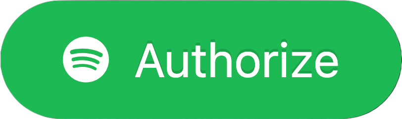

# Spotify Recently Played for Framer
Display your recently played Spotify tracks on your Framer website. Powered by [Vercel](https://vercel.com).

Heavily based on [spotify-recently-played-readme by JefferyCA](https://github.com/JeffreyCA/spotify-recently-played-readme) 

## Getting Started
Since Spotify has limited 'Extended Qouta' to organizations only, you can either join my app as a user or deploy your own Vercel app.

## Join My App
Click the button below to fill out my contact form. I will add you as an authorized user to my app

> By authorizing the app, you agree to have your Spotify username, access token, and refresh token stored on a secure Firebase database. This is required so you only need to authorize once and the app can automatically refresh access tokens in order to retrieve recent tracks.
>
> You can revoke the app at https://www.spotify.com/account/apps.

<a href="https://spotify-recently-played-teal.vercel.app"></a>

After granting permission, just copy the generated Framer Code into a code file in Framer and drag the generated component into canvas.

## Deploying own Vercel instance
[](https://vercel.com/new/git/external?repository-url=https%3A%2F%2Fgithub.com%2FAvishkar15%2Fspotify-recently-played-framer&env=NEXT_PUBLIC_CLIENT_ID,NEXT_PUBLIC_BASE_URL,NEXT_PUBLIC_REDIRECT_URI,CLIENT_SECRET,FIREBASE_PROJECT_ID,FIREBASE_PRIVATE_KEY_B64,FIREBASE_CLIENT_EMAIL)

Deploy your own Vercel instance using the link above. Next, set the following environment variables:

| Name | Description |
|---|---|
| `NEXT_PUBLIC_REDIRECT_URI` | Callback URI from Spotify |
| `NEXT_PUBLIC_BASE_URL` | Base URL of the project |
| `NEXT_PUBLIC_CLIENT_ID` | Spotify app client ID |
| `CLIENT_SECRET` | Spotify app client secret key |
| `FIREBASE_PROJECT_ID` | Firebase project ID |
| `FIREBASE_PRIVATE_KEY_B64` | Base64-encoded string of Firebase private key |
| `FIREBASE_CLIENT_EMAIL` | Firebase client email |
| `FIREBASE_DATABASE_URL` | Firebase database URL |


## Running locally
1. Clone Git repo
    ```sh
    $ git clone https://github.com/Avishkar15/spotify-recently-played-framer.git
    ```
2. Install Node dependencies
    ```sh
    $ npm install
    ```
3. Create `.env` file containing required environment variables:
    ```sh
    NEXT_PUBLIC_REDIRECT_URI=<Callback URI from Spotify>
    NEXT_PUBLIC_BASE_URL=<Base URL of the project>
    NEXT_PUBLIC_CLIENT_ID=<Spotify app client ID>
    CLIENT_SECRET=<Spotify app client secret key>
    FIREBASE_PROJECT_ID=<Firebase project ID>
    FIREBASE_PRIVATE_KEY_B64=<Base64-encoded string of Firebase private key>
    FIREBASE_CLIENT_EMAIL=<Firebase client email>
    FIREBASE_DATABASE_URL=<Firebase database URL>
    ```
4. Edit `utils/Constants.ts` and set the `ClientId`, `BaseUrl`, `RedirectUri` values.
5. Run development server
    ```sh
    $ npm run dev
    ```

The app will be running at [http://localhost:3000](http://localhost:3000).


This is a bit of a hacky workaround and may not 100% eliminate the issue. If you have any better solutions or have general optimizations feel free to create a PR!

## License
[MIT](LICENSE)
